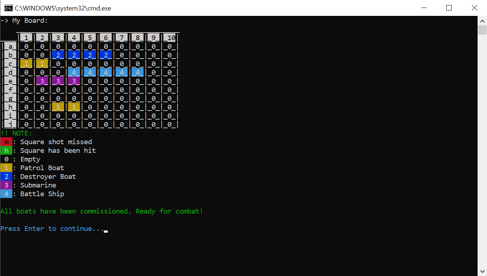

# Sea Battle

Sea Battle là một trò chơi dành cho hai người chơi. Trò chơi được chơi trên bốn lưới, hai cho mỗi người chơi. Các lưới thường là vuông - thường là 10 × 10 - và các ô riêng lẻ trong lưới được xác định bằng chữ cái và số. Trên một lưới, người chơi sắp xếp các tàu và ghi lại các phát bắn của đối thủ. Trên lưới còn lại, người chơi ghi lại các phát bắn của riêng mình.


## Cách thức clone

- Đầu tiên tạo nhánh của mình như hướng dẫn từ nhánh develop này.
- Sau đó clone nhánh của mình về máy.
- Tiếp theo làm việc trên nhánh của mình, cấu trúc folder như folder Nguyễn Văn A có sẵn.
- Sau khi làm xong, push lên nhánh của mình, tạo pull request để merge vào nhánh develop.
- Các em có thể sửa readme mặc định ở folder của mình cho đẹp, làm repo trở nên sinh động hơn cho github của mình. (có thể tham khảo cách làm file này, bỏ phần này đi, thay bằng phần của mình)

Cấu trúc folder

```bash

├── branch develop
│   ├── Nguyễn Văn A
│   │   ├── Product
|   |   |   ├── src
|   |   |   |   ├── main
|   |   |   |   |   ├── java
|   |   |   |   |   │   ├── controller
│   │   │   ├── README.md
│   │   │   ├── image.png
│   │   │   └── ...
│   │   ├── UML
│   │   │   ├── README.md
│   │   │   ├── image.png
│   │   │   └── ...
│   │   ├── README.md
│   │   └── ...
│   ├── Nguyễn Văn B
```


## Requirements, User Stories

### User Story 
- Hân là một sinh viên trẻ tài năng cùng những ý tưởng đầy táo bạo. Cô nhận thấy trong lớp đang thịnh hành một trò chơi sử dụng giấy, tức là ta sẽ gập tờ giấy làm đôi, vẽ hai bảng ở 2 mặt và hai người sẽ đánh các vật thể - thuyền trên các ô trên mặt của mình. Hai bên không biết vị trí tàu của bên kia và sẽ vẽ bắn thử ở 1 mặt, rồi sau đó gập giấy lại xem điểm bắn đó có trùng với ô nào mặt đối thủ không, và phá huỷ vị trí đó. ☄️

- 👾 Quy trình chơi game này khá dài dòng và khó hiểu, hơn nữa còn tạo ra nhiều giấy rác trong lớp. Sau vài ngày suy nghĩ, cô đã vẽ ra được những ý tưởng sơ thảo cho một phần mềm, hứa hẹn giải quyết bài toán này.


---
### Yêu cầu sản phẩm
- Là một người chơi, tôi có thể vào game và bắt đầu chơi. Sẽ có hai người chơi trong một ván game và lượt sẽ được luân phiên.

#### 📝 Vòng chuẩn bị
- Ban đầu, người chơi được cho 1 bảng 10x10, một cột đánh từ A->J, một cột đánh từ 1->10. Mỗi người chơi sở hữu 5 con thuyền như sau:
    - 2 Thuyền Tuần Tra (Patrol Boat) 1x2
    - 1 Tàu Khu Trục (Destroyer Boat) 1x4
    - 1 Tàu Ngầm (Submarine) 1x3
    - 1 Thiết Giáp Hạm (Battle Ship) 1x5


- Người chơi sẽ có thể nhập vào 2 toạ độ (X,Y) với từng mẫu thuyền để đặt thuyền, màn hình sẽ hiển thị thuyền lên bảng. Sau khi đặt xong hết, sẽ sang lượt đặt của người kia.

---
#### 📝 Trong Game
- Trong trò chơi, lượt của hai người chơi sẽ luân phiên nhau. Trong lượt của 1 người, anh có thể chọn các lựa chọn sau:
- Khi hiển thị menu lựa chọn, hiển thị luôn tình hình hiện tại: gồm số ô đã bắn ở mặt trận địch, số tàu đã phá, số tàu còn lại của bản thân.
    - Xem bảng, cách đặt thuyền của bản thân (Nếu hai người cùng chơi trên 1 máy tính, lúc này anh sẽ tạm quay máy tính đi để xem cục diện hiện tại)
    - Đặt lệnh khai hoả, có thể nhập 1 toạ độ X,Y để tiến hành khai hoả vào mặt trận đối phương, nếu trúng bất kì điểm nào của thuyền thì sẽ có thông báo, còn không trúng thì thôi. Người chơi có thể xem được bảng của đối phương ở dạng sương mù (tức là hiển thị những điểm nào đã bị bắn vào rồi, bao gồm điểm nào đã bắn vào nhưng không có gì, điểm nào đã bắn vào nhưng có một phần tàu ở đó, ...) các ô khác thì không hiển thị thông tin gì
    - Kết thúc lượt

---
#### 📝 Luật trò chơi
- 1 tàu sẽ bị phá huỷ chỉ sau khi toàn bộ điểm bị phá hết. ví dụ tàu 1x5 thì ít nhất 5 phát bắn trúng đích toàn bộ để phá
- Khi bên nào bị phá hết tàu trước lập tức thua cuộc và - hiển thị màn hình kết quả, bảng của cả 2 bên

### [YÊU CẦU SẢN PHẨM CUỐI]
#### MVP VERSION (Minimum viable product) - Chức năng buộc phải có


    - Menu mới bắt đầu có thể bắt đầu game
    - Vòng chuẩn bị, đủ các loại tàu, bảng 10x10, có thể đặt tàu
    - Vòng chơi, luân phiên lượt, có thể bắn qua lại với nhau, xem các lựa chọn như yêu cầu
    - Có điều kiện kết thúc game
    - Việc đặt tàu, bắn tàu (các công đoạn nhập liệu) bên trên có thể cho phép happy case (giả định người dùng không nhập ra ngoài, nhập tàu không chồng lấn nhau) và không cần xác minh
---
#### Chức năng có thể làm thêm (Sau khi hoàn thành MVP) - Không bắt buộc


##### Độ khó ⭐
- Cơ chế kiểm tra khi nhập liệu cần kiểm tra không cho đặt tàu chồng lấn, đặt tàu ngoài vùng, bắn điểm ngoài vùng, bắn điểm đã bắn, ...
- Hiển thị giao diện bảng rõ ràng, có thể dùng emoji, kí tự đặc biệt, ...
- Output màn hình hiển thị menu, bảng của hai bên có thể in ra màu (https://www.geeksforgeeks.org/how-to-print-colored-text.../), có thể hiển thị vùng bị bắn rồi, chỗ tàu bị nổ, ... rõ ràng và đẹp hơn

##### Độ khó ⭐⭐
- Chế độ tự động đặt tàu ngẫu nhiên ở vòng chuẩn bị
- Thêm tính năng bảng xếp hạng số lượt bắn ít nhất, số tàu còn lại của người chơi khi thắng, Lúc này khi vào game cần nhập thêm tên người chơi để lưu lại, ở menu ban đầu có thể chọn hiển thị bảng xếp hạng

##### Độ khó ⭐⭐⭐
- Cho phép chơi với máy ở menu bắt đầu, máy tự động đặt thuyền, và bắn ngẫu nhiên, biết chơi greedy như tập trung bắn nốt 1 tàu khi đã bắn trúng được 1 điểm
- Thêm tính năng lưu trạng thái của game để chơi tiếp khi thoát, trạng thái của 1 game bao gồm trạng thái bảng của 2 người chơi, lượt hiện tại, .. Sau đó ở menu ban đầu có thể chọn load game để chơi tiếp
- Cơ chế vẽ bảng dynamic, cho phép truyền vào 1 số để có bảng là hình vuông từ 10x10 đến 20x20, mọi tính năng vẫn chạy tốt


